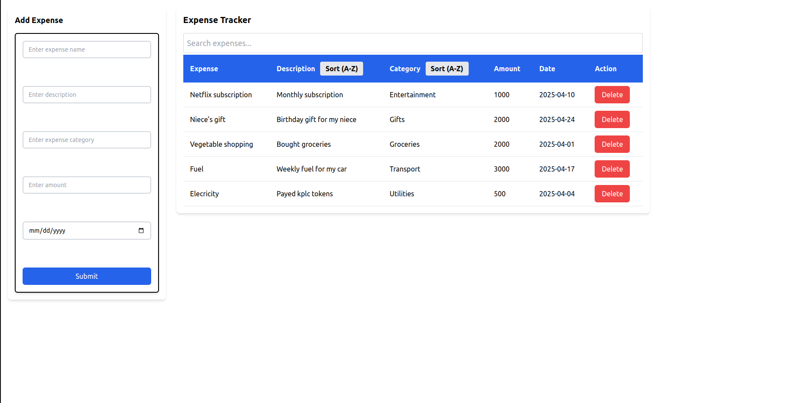

# Expense Tracker Application



A simple yet powerful expense tracking application built with React that helps users manage their expenses.


## Features

### Core Functionality
- 📝 **Add Expenses**
  - Expense name, description, category, amount, and date
  - Form validation for required fields
- 📊 **View Expense Table**
  - Clean tabular display of all expenses
  - Responsive design that works on all devices

### Advanced Features
- 🔍 **Search Functionality**
  - Filter expenses by name or description
  - Case-insensitive matching

- 🔄 **Sorting**
  - Sort by Description, or Category
  - Toggle between A-Z 

- ❌ **Delete Expenses**
  - Remove unwanted expenses with one click
  - Instant table updates

  ## Installation

1. Clone the repository:
   ```bash
   git clone https://github.com/your-username/expense-tracker.git

Install dependencies:

cd expense-tracker
npm install

Start the development server:
npm start

Usage
1. Adding an Expense:

Fill out all fields in the "Add Expense" form

Click "Submit" to add to the table

2. Sorting Expenses:

Click any column header to sort A-Z 


3. Searching Expenses:

Type in the search bar to filter results

Matching expenses appear instantly

4. Deleting Expenses:

Click the red "Delete" button on any row

Expense is immediately removed

 Technologies Used
⚛️ React (v18+)

🎨 CSS (inline styling)

🗃️ React Hooks (useState)

🔄 Array methods (sort, filter, map)               


